🛍️ OnlineShop-App

Die OnlineShop-App ist eine vollständige Webanwendung für einen Online-Shop, entwickelt mit Node.js, Express und einem jQuery-basierten Frontend. Sie ermöglicht das Verwalten von Produkten, einschließlich Hinzufügen, Bearbeiten, Löschen und Anzeigen von Produkten mit Authentifizierung und Autorisierung.
----------------------------------------------------------------------------

📋 Inhaltsverzeichnis

    - Funktionen
    - Technologien
    - Projektstruktur
    - Installation
        . Backend
        . Frontend
    - API-Endpunkte
    - Screenshots
    - Autor
    - Lizenz
---------------------------------------------------------------------------------

📦 Funktionen

    - Produktverwaltung (CRUD: Erstellen, Lesen, Aktualisieren, Löschen)
    - Benutzer-Authentifizierung mit JWT
    - Frontend mit jQuery und AJAX
    - Responsive Design mit Bootstrap
    - RESTful API mit Express
    - MySQL-Datenbankanbindung
--------------------------------------------------------------------------

🛠️ Technologien

    - Backend: Node.js, Express.js, MySQL
    - Frontend: HTML, CSS, jQuery, Bootstrap
    - JSON Web Tokens (JWT)    
    -Test Postmann
---------------------------------------------------------------------------

🗂️ Projektstruktur

onlineshop-app/
├── backend/backend
│   ├── config/             
│   ├── controllers/       
│   ├── models/            
│   ├── routes/             
│   ├── public/           
│   ├── views/             
│   ├── .env               
│   ├── app.js              
│   ├── package.json      
├── frontend/
│   ├── css/
│   ├── js/
│   ├── index.html
│   └── add-product.html
└── README.md         
-------------------------------------------------------------------------

🚀 Installation

    1. Repository klonen:
        git clone https://github.com/AveenAl-Hadad/OnlineShop-App.git
        cd onlineshop-app

    2. Abhängigkeiten installieren:
        npm install

    3. Datenbank einrichten:
        - MySQL starten
        - Datenbank erstellen:
            CREATE DATABASE onlineshop;

    4. Umgebungsvariablen konfigurieren:
        .env-Datei im Stammverzeichnis erstellen:
            DB_HOST=localhost
            DB_USER=dein-benutzername
            DB_PASSWORD=dein-passwort
            DB_NAME=onlineshop
            JWT_SECRET=dein-jwt-secret
            PORT=5000

    5. Server starten:
        npm start
Frontend

   1.  Wechsle in das Frontend-Verzeichnis:
    cd ../frontend

   2.  Öffne index.html in deinem Browser oder verwende eine Live-Server-Erweiterung in deinem Code-Editor.

------------------------------------------------------------------------------------

📡 API-Endpunkte

Produkte
    - GET /api/products – Alle Produkte abrufen

    - POST /api/products – Neues Produkt hinzufügen

    - PUT /api/products/:id – Produkt aktualisieren

    - DELETE /api/products/:id – Produkt löschen
    

Authentifizierung

    - POST /api/auth/login – Benutzeranmeldung

    - POST /api/auth/register – Neuen Benutzer registrieren

Bestellung

    - GET /api/orders/user - Alle Bestellung für gemeldete Benutzer

    - GET /api/order/all  - Alle Bestellung für Admin Bereich

    - POST /api/orders  - Benutzer Bestllung bestellt
------------------------------------------------------------------------------

🖼️ Screenshots
- Startseit Fenster

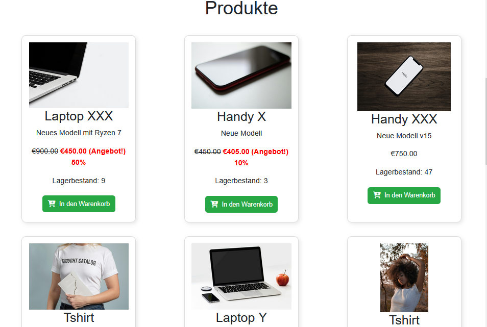
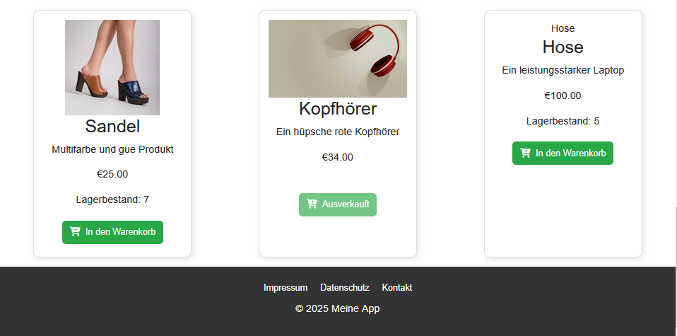

-Registiern
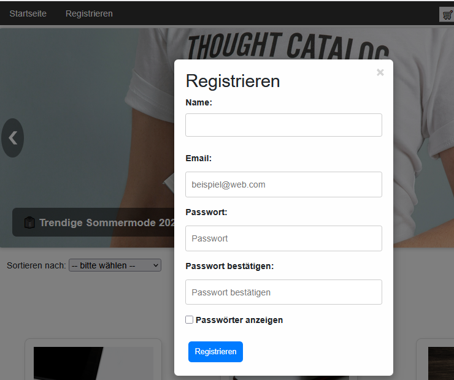

- Login
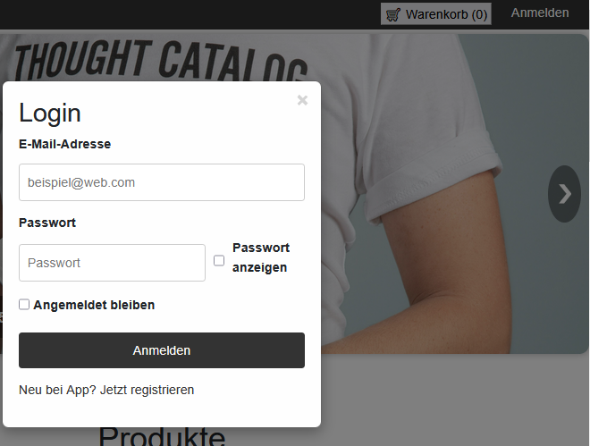

-Admin Bereich
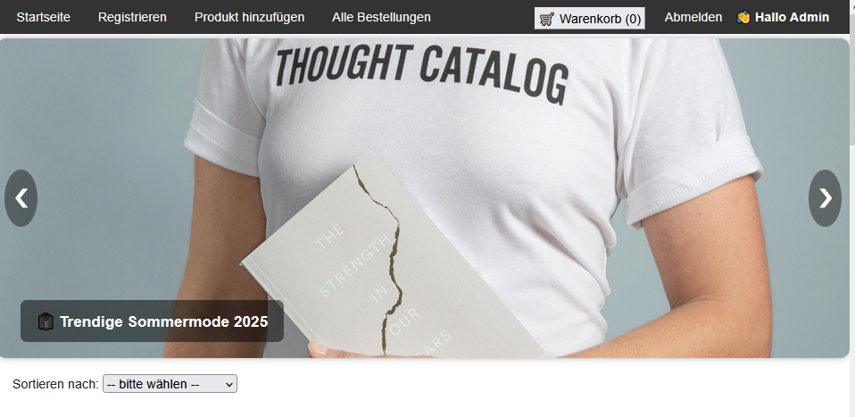
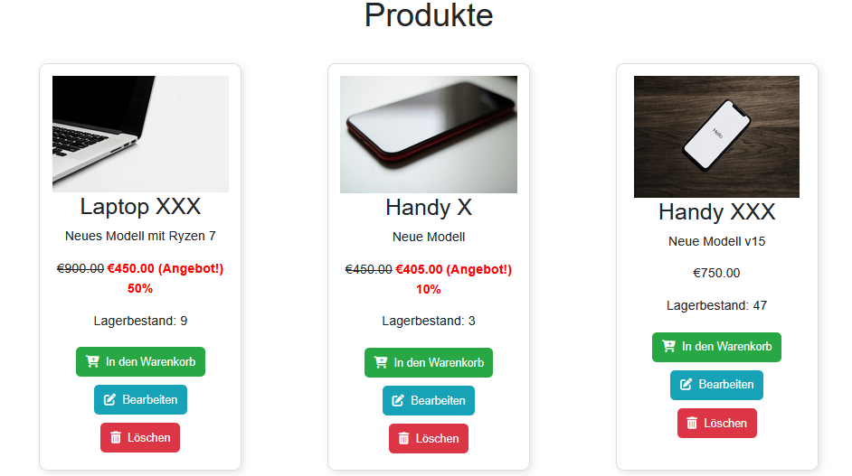
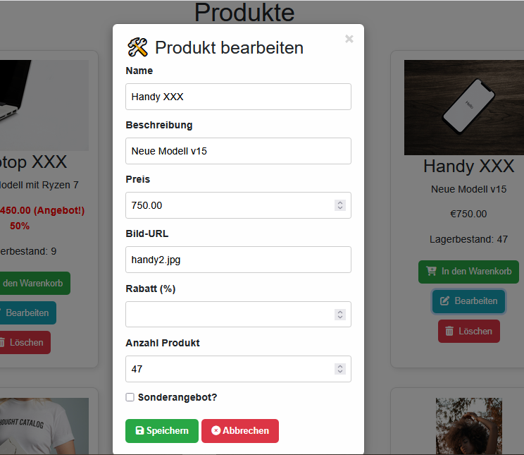
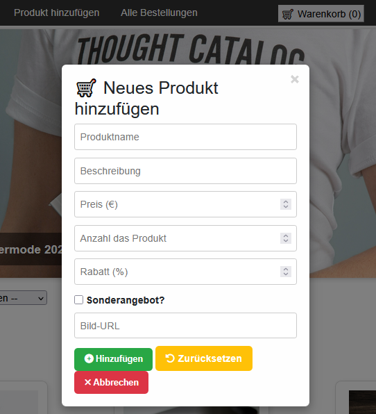

-Kunden oder Benutzer Bereich
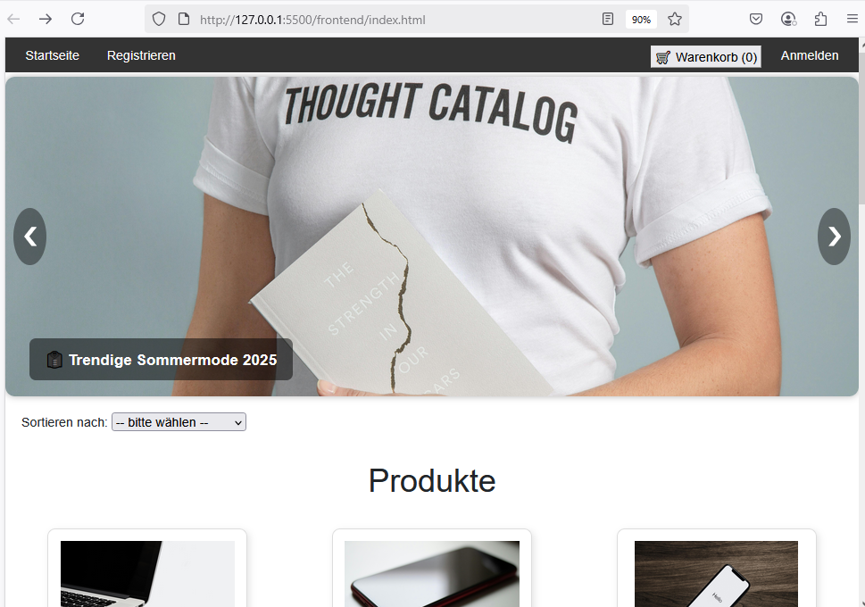
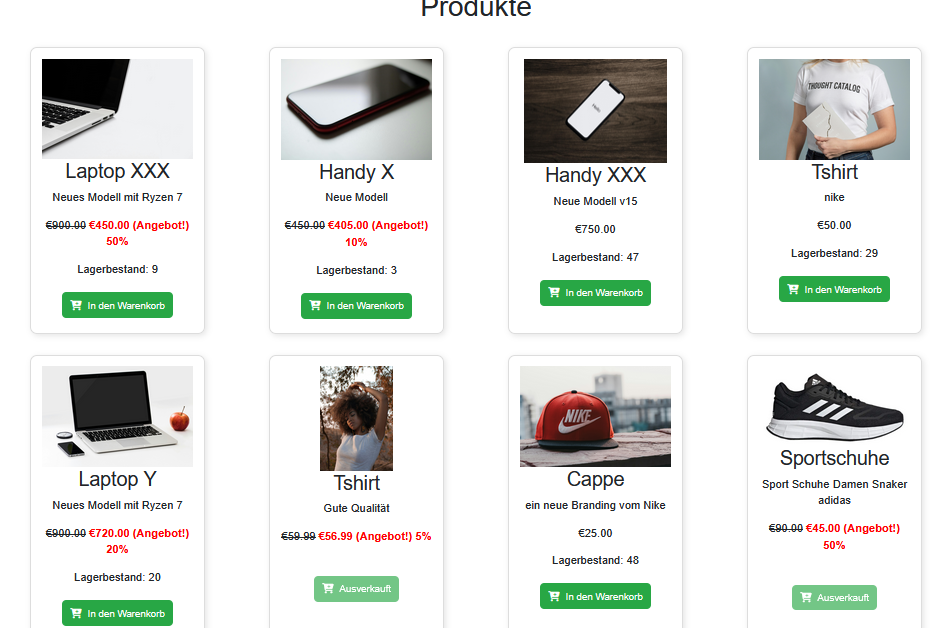
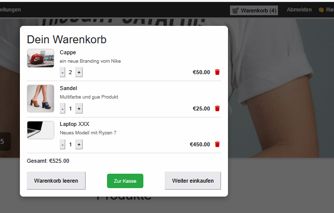
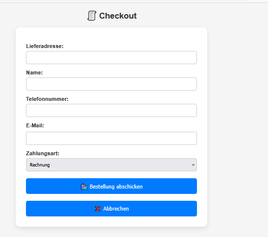
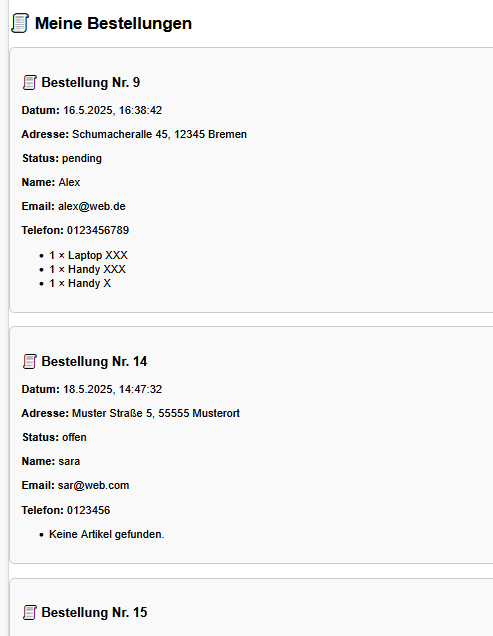
--------------------------------------------------------------------------------------

👤 Autor

    Aveen Al-Hadad

    GitHub: @aveen-alhadad

--------------------------------------------------------------------------------------

📄 Lizenz

Dieses Projekt ist unter der MIT-Lizenz lizenziert.

MIT License

Copyright (c) [2025] [Aveen Al-Hadad]